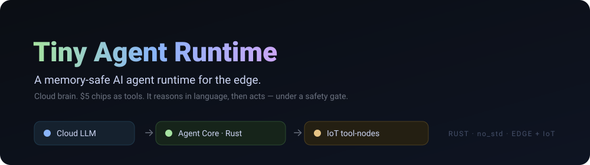
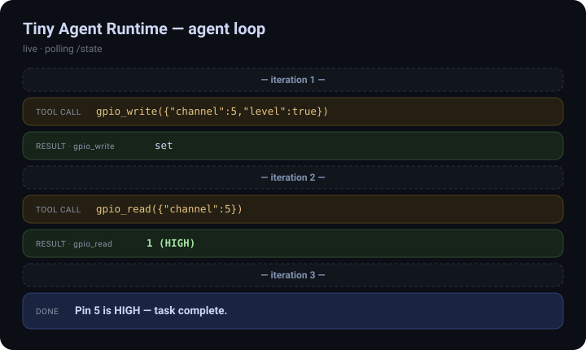
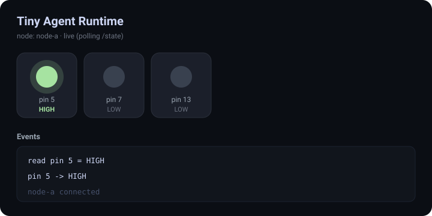
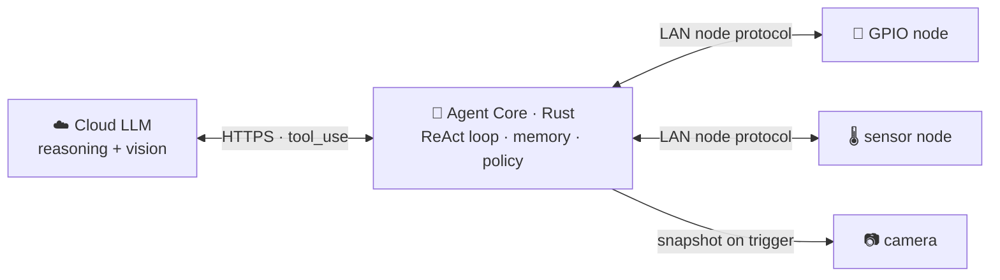

<div align="center">



<br>


**One Rust core runs on a $5 microcontroller _or_ a Linux camera SoC.**
It talks to a cloud LLM for intelligence and lets **any IoT chip register itself as a tool the agent controls** — a relay, a sensor, a camera, a lock.

[Quickstart](#-quickstart) · [See it run](#-see-it-run) · [Architecture](#-architecture) · [Use cases](#-use-cases) · [Roadmap](docs/ROADMAP.md)

</div>

---

## ✨ What makes it different

| | |
|---|---|
| 🧠 **One core, two tiers, one protocol** | The same agent logic compiles to bare-metal ESP32 (`no_std`) and to a Linux edge SoC (`std`). The wire protocol is defined once and shared. |
| 🔌 **IoT chips as first-class tools** | Local and remote tools implement the *same* trait. Adding hardware = implement one trait, advertise a capability — no change to the agent. |
| 👁️ **Cloud intelligence, edge cost discipline** | Vision runs in the cloud, triggered by a cheap on-device pre-filter — so "an AI watching your cameras" costs cents, not dollars, a day. |
| 🛡️ **Safe by construction** | Memory-safe Rust on the network/actuator paths, plus a policy engine that rate-limits and gates physical actions. A prompt-injected model can't throw a relay. |

---

## 🎬 See it run

Two live dashboards. The **agent loop** shows the model thinking and acting in real time; the **node** shows the actual pins flipping as a *separate* chip executes the tools.

<table>
<tr>
<td width="50%" valign="top">

**🧠 Agent loop** — `http://localhost:8091`



</td>
<td width="50%" valign="top">

**🔌 Node pins** — `http://localhost:8090`



</td>
</tr>
</table>

> Watch the agent reason → call `gpio_write` → see pin 5 light up green → read it back → finish. The events are emitted by the real ReAct loop in `tar-core`, not a mock animation.

---

## 🚀 Quickstart

```bash
git clone https://github.com/juntoku9/tiny-agent-runtime
cd tiny-agent-runtime
cargo build --workspace
cargo test --workspace      # builds everything + runs the ReAct-loop test
```

<details>
<summary><b>▶︎ Watch the agent loop (no API key needed)</b></summary>

<br>

Runs a paced, scripted loop so you can watch it end-to-end offline.

```bash
# Terminal 1 — the tool-node (the "$5 chip") + its dashboard on :8090
./target/debug/tar-node-sim

# Terminal 2 — the agent loop + its dashboard on :8091
./target/debug/tar-agent
```

Open **http://localhost:8091** (agent loop) and **http://localhost:8090** (pins) and watch them update together.

</details>

<details>
<summary><b>☁️ Let the real cloud model drive the hardware (needs a key)</b></summary>

<br>

Same dashboards — but now the model decides which tools to call.

```bash
./target/debug/tar-node-sim &      # node + pin dashboard
ANTHROPIC_API_KEY=sk-ant-... ./target/debug/tar-agent
```

The timeline shows the model's real reasoning text and the tool calls *it* chooses. Use `TAR_MODEL=claude-haiku-4-5-20251001` for a cheaper run.

</details>

<details>
<summary><b>🔧 Headless protocol check</b></summary>

<br>

```bash
./target/debug/tar-node-sim &
./target/debug/tar-brain          # discovers tools, toggles pin 5, asserts HIGH, exits 0
```

Ports are configurable: `TAR_NODE_ADDR`, `TAR_DASH_ADDR`, `TAR_AGENT_ADDR`.

</details>

---

## 🧩 Architecture



The brain is pure logic; platform crates are thin and are the **only** place I/O lives.

```
crates/
  tar-core     no_std · agent loop, tools, memory contracts (zero I/O)
  tar-hal      trait defs: Storage, Clock, HttpClient, Transport, Actuator, Camera
  tar-proto    serde node-protocol + tool schemas, shared by every node
  tar-llm      Anthropic provider (OpenAI-compatible fallback)
  tar-tools    built-in tools (gpio, …), feature-gated for tiny builds
  tar-policy   capability + rate-limit + human-confirm engine
platforms/
  tar-linux    Linux SoC "brain" + node simulator + dashboards
  tar-esp32    ESP32 (esp-idf-svc HAL)        tar-node   minimal controller chip
```

Full write-up: **[ARCHITECTURE.md](ARCHITECTURE.md)**.

---

## 💡 Use cases

A few of the [14 scenarios](docs/USE_CASES.md) you can build on these pieces:

| | | |
|---|---|---|
| 🎥 **Camera that explains** | "a courier left a package by the door" → opens the parcel locker under policy | vision + relay + gate |
| 🔥 **Safety guardian** | sees flames *and* reads smoke → alarm + cut bench power | multi-modal corroboration |
| 🌿 **Plant keeper** | checks soil + forecast + a look at the plant → waters only when needed | sensor + web + vision |
| 🦉 **Backyard naturalist** | PIR-wake trail cam IDs species → "barred owl, 3:14am" | snapshot vision, months on a battery |
| 🐾 **Pet feeder** | identifies *which* pet, dispenses the right portion, rate-limited | vision-conditioned actuation |
| 🏭 **Predictive maintenance** | one brain baselines many machines, flags "bearing wear on conveyor 3" | a fleet of nodes |

→ **[All 14 use cases](docs/USE_CASES.md)**

---

## 📍 Status

Early development, built in verifiable phases:

- ✅ Portable `no_std` core + HAL traits + shared protocol
- ✅ Live cloud-LLM round-trip (Linux)
- ✅ LAN node protocol + remote tools + dynamic discovery
- ✅ ReAct tool loop — the model drives local *and* remote tools
- ✅ Live web dashboards (agent loop + node pins)
- ⏳ Policy enforcement · camera perception · ESP32 on real hardware

See **[docs/ROADMAP.md](docs/ROADMAP.md)** for the phased plan and per-phase success criteria.

---

<div align="center">
<sub>Built with Rust · cloud-powered · edge-deployed · <a href="CLAUDE.md">engineering guidelines</a></sub>
</div>
